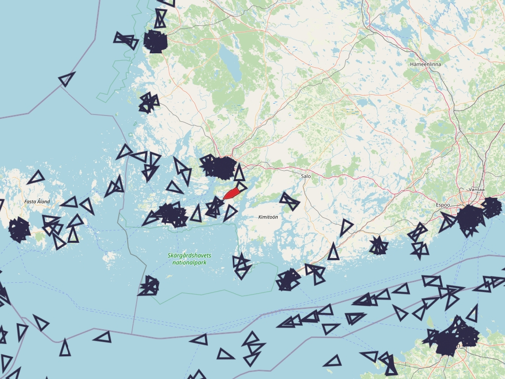

# signalk-net-ais-plugin

SignalK plugin to gather marine traffic information (AIS) from Finnish Transport Agency’s data sources, https://www.digitraffic.fi/en/.

AIS targets around the vessel in Turku archipelago, radius set to 200km

User can configure:
- How often data is fetch
- How old data is fetch
- Radius around the vessel, which filter data

New:
- v1.1.0, source info added
- v1.0.0, v1 release
- v0.0.15, fix: skip data fecthing if no location available & location.sensorType
- v0.0.14, fix: eta & timestamp
- v0.0.13, fix: ais path
- v0.0.12, fix: state mapping and dashboard reporting updated
- v0.0.11, fix: callsignVhf and imo paths
- v0.0.10, fix
- v0.0.9, fix: key/value locations aligned with AIS input
- v0.0.8, fix: fetch error logs to console
- v0.0.7, fix
- v0.0.6, all available meta data added
- v0.0.5, sog calculation corrected
- v0.0.4, Meta data (AIS names) for target
