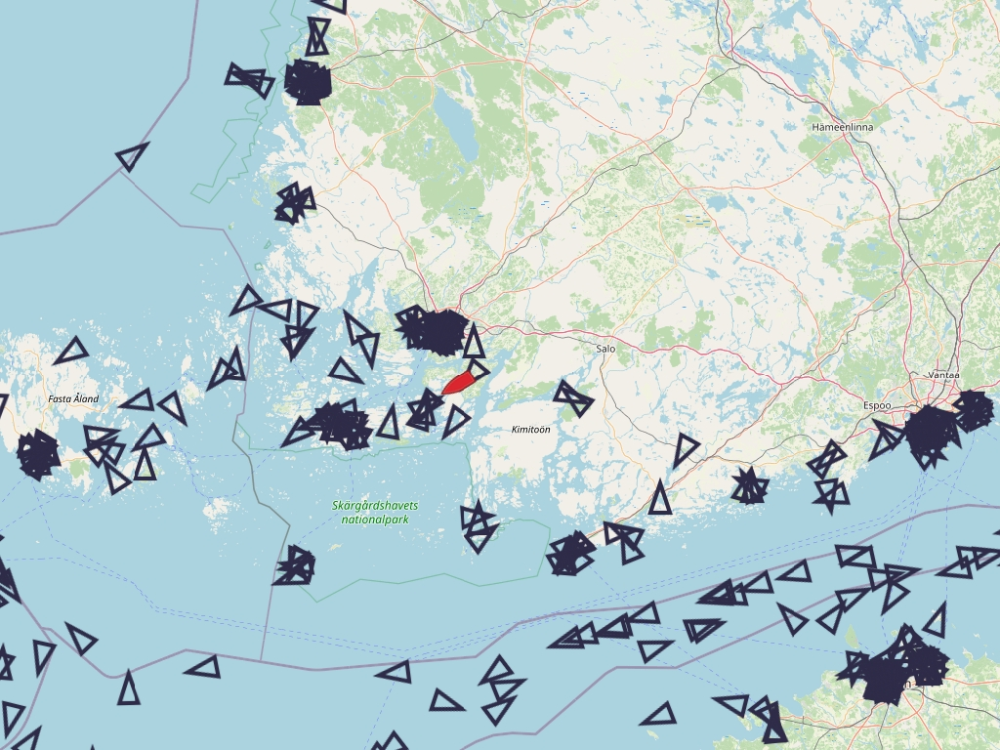

# signalk-net-ais-plugin
[](https://badge.fury.io/js/signalk-net-ais-plugin)
[](https://snyk.io/test/github/KEGustafsson/signalk-net-ais-plugin)
[](https://github.com/KEGustafsson/signalk-net-ais-plugin/actions/workflows/signalk-plugin-ci.yml)

SignalK plugin to gather marine traffic information (AIS) from Finnish Transport Agency’s data sources, https://www.digitraffic.fi/en/.

**Requires Node.js 18 or later** (uses built-in fetch API).


AIS targets around the vessel in Turku archipelago, radius set to 200km

User can configure:
- How often data is fetch
- How old data is fetch
- Radius around the vessel, which filter data

## Development

```bash
npm install        # install dependencies
npm run lint       # type-check
npm run build      # clean and compile TypeScript to dist/
npm test           # run tests
```

## Continuous integration

Every push and pull request runs the shared
[SignalK Plugin CI](https://github.com/SignalK/signalk-server/blob/master/.github/workflows/plugin-ci.yml)
reusable workflow. It validates the plugin manifest, entry point, JSON schema
and the start/stop/restart lifecycle, then builds and runs the test suite on
Linux (x64 and arm64), macOS and Windows with Node 22 and 24.

The advisory armv7 leg (Cerbo GX / Venus OS, Node 20 under QEMU emulation) is
**not** run automatically — it takes roughly half an hour of emulated CI per
push. Run it on demand from **Actions → SignalK Plugin CI → Run workflow** with
*Run armv7 (Cerbo GX) tests via QEMU* ticked. The same manual trigger can start
a SignalK server and install the plugin into it for an integration test.

## Changelog

See [CHANGELOG.md](CHANGELOG.md).
